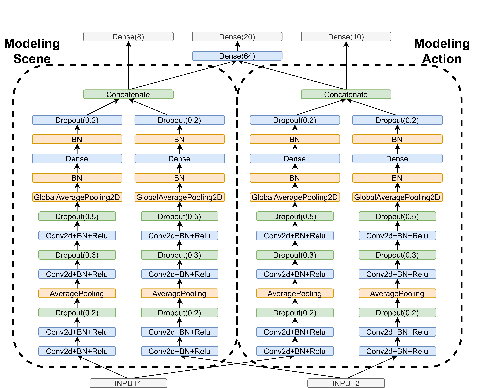

# 🥟交子杯 - 2020 - AI赛道 - TOP1

## summary

陆陆续续两个月的赛程结束了，从初赛A榜27到B榜第4，再到决赛A，B双榜第一，有过断断续续排名下降即将无缘现场决赛的失落，也有过现场决赛等待被超越的12小时，心情跌到起伏像极了今年来的股市。

下面进入正题，介绍MTM在这个比赛的相关工作，该方案来自MTM里面的两只年轻滚滚biubiubiu以及lcy。初赛选手及未参加的同学建议全篇阅读，决赛选手建议阅读集成与模型中LGB模型这两个小节，来快速温习我们取胜的关键。

代码开源地址：由于主办方要求，代码暂时无法开源，在此我们尽量将方案描述清楚

## 题目要求
本次赛题旨在使用手机中的加速度传感器数据（包含重力加速度(acc_xg, acc_yg, acc_zg)和不含重力加速度(acc_x, acc_y, acc_z)），来进行不同场景下（站立，行走，坐卧）的行为（刷抖音，玩游戏...）预测，以期智能检测手机端的金融诈骗行为。详细介绍请参考[官方网站](https://www.kesci.com/home/competition/5ece30cc73a1b3002c9f1bf5/content)。

## 数据说明
初赛提供了7500左右的训练数据与7500条的测试数据，做一个人19分类，决赛数据量大约是初赛的两倍，做一个20分类，类别较初赛有所增删。

**注意**：初赛数据，训练集与测试集分布差异较大（可以通过一些特征选择方法看出，猜测很可能是是按采集数据所用的设备id，或者按采集数据的志愿者id划分的），而采样点数据分布相对集中，集中在60左右。决赛数据分布差异则不太明显（猜测是按照样本id随机划分的，另外可进一步推测决赛AB榜也是按照样本id随机划分的），但是采样点数据分布差异很大，中值22，最大值60+，最小值只有2。另外，决赛数据精度要比初赛数据高。

**采样点数量与训练集测试集分布**这两点的变化是决赛破题的关键。

 
 决赛数据采样点数量分布

 
 
 决赛数据train test分布差异很小


## 比赛流程
初赛时间：6.17-8.7，形式为线上A，B榜，B榜前30名，提交docker复现，取前10名现场决赛，现场决赛分代码比拼跟现场答辩两部分。

其中代码比拼赛制与初赛一样，时长25小时，共50次提交机会，很多选手不分昼夜，持续作战。有许多队伍决赛逆袭，甚至一战登顶。非常适合临场发挥稳定的选手参加。另外，决赛提供**一块V100(16G)**，不允许使用额外的算力，不允许使用初赛数据训练和预训练。这非常考验初赛模型的鲁棒性与轻便性，以及参赛选手的临场发挥能力。

## 思路

我们着眼的这个题的难点在于：1.**在保证特征交互的同时下对时序建模2.有效解决采样点数量差异**（决赛）
- 对于1，我们尝试了CNN2d,CNN1d,LSTM这类自动化特征交互与时序建模的模型，也尝试了在特征工程阶段进行部分特征交互以及时序模式抽取，让模型成为学习特征组合的主力（LightGB）
- 对于2，我们通过设计特长不同的专家模型有针对性的对长系列与短序列的建模，然后使用stacking进行集成，并进行引导择优。

## 模型
### Conv2d


初赛模型以OTTO开源的baseline为基础，做了如下几个调整：
1.	添加以下补充特征序列（可以看成一种预先的特征交互）

```python
def add_features(df):
    print(df.columns)
    df['acc'] = (df.acc_x ** 2 + df.acc_y ** 2 + df.acc_z ** 2) ** .5
    df['accg'] = (df.acc_xg ** 2 + df.acc_yg ** 2 + df.acc_zg ** 2) ** .5
    df['thetax']=np.arctan(df.acc_xg/
                           np.sqrt(df.acc_yg*df.acc_yg+df.acc_zg*df.acc_zg))*180/np.pi
    df['thetay']=np.arctan(df.acc_yg/
                           np.sqrt(df.acc_xg*df.acc_xg+df.acc_zg*df.acc_zg))*180/np.pi
    df['thetaz']=np.arctan(df.acc_zg/
                           np.sqrt(df.acc_yg*df.acc_yg+df.acc_xg*df.acc_xg))*180/np.pi

    df['xy'] = (df['acc_x'] ** 2 + df['acc_y'] ** 2) ** 0.5
    df['xy_g'] = (df['acc_xg'] ** 2 + df['acc_yg'] ** 2) ** 0.5    
    
    df['g'] = ((df["acc_x"] - df["acc_xg"]) ** 2 + 
                 (df["acc_y"] - df["acc_yg"]) ** 2 + (df["acc_z"] - df["acc_zg"]) ** 2) ** 0.5

    print(df.columns)
    return df
train=add_features(train)
test=add_features(test)

```
2.	决赛时，使用了重复拼接短序列凑齐60的策略，其他方式（如zero-padding,resample）未尝试。
3.	使用Con2d-BN-ReLU代替Con2d-ReLU-BN,并添加Dropout层。
4.	将输入特征进行分组，分别经过一个同样结构（但不共享参数）的卷积模块。这样可以使卷积核更有针对性提取各组特征内部的潜在规律，并且往往可以使用更少的卷积核得到更好的效果。
5.	使用了两个辅助分类场景与动作的loss（交叉熵损失），因此总共有3个loss，同时对于每一个loss内的label设置权重。
6.  使用MixUp数据扩增，同时为了防止潜在的问题，仅在相同label内进行数据扩增（可视化后发现比如递手机之类的动作可能只有一半的采样点有实际意义，所以认为全数据的mixup可能产生非常多的错误标签）
7.	决赛过程中,为了进一步强化5的效果，对模型结构做了进一步修改，即采用两个独立的卷积模块（同样结构，但不共享参数）分别对场景与动作进行建模，这一操作帮助我们将单模最高由77提升至78。

8.	在初赛过程中一个有意思的操作是：将原始特征标准化之后，过fft变换到频域后，训练上述模型，可以取得76左右的成绩（初赛线上），与时域数据训练的模型进行集成，有5个千分位的提升，这一操作在决赛中并不奏效（效率太短，过fft效果不好）。
9.	初赛复赛均使用Adam优化器（tensorflow.keras.optimizers.Adam默认参数），初赛为五折交叉验证，复赛由于事件原因使用三折交叉验证


### LSTM


LSTM模型，采用与CNN2d相同的分组提取的思路，LSTM模块中添加LayerNormalization与DropOut层可以明显提升模型线上效果（初赛），SelfAttentionLayer收益不大，另外，需要对数据预先进行标准化处理（即对原始DataFrame按列标准化），否则模型很难收敛到很好的效果。决赛沿用了与初赛相同的模型,复赛线上77。

### LightGBM

作为梯度提升模型永远的神，LightGBM模型结合统计特征对时序进行建模具有很强的可解释性及出色的泛化能力。在决赛GPU资源有限的情况下，充分利用CPU资源不得不说是一个非常好的发力点。
在初赛过程 LightGB的表现并不抢眼（73左右），而在决赛数据中却大放异彩（768）。我们考虑可能的原因如下：
1.	决赛数据量是初赛的两倍，更多的数据帮助LightGBM模型获得了更好的泛化效果
2.	提却短序列的统计特征往往比提却长序列的统计特征损失的信息更少，而决赛的序列长度偏短，所以较初赛表现更佳
3.	较NN而言，树模型的短序列建模能力不见得差。


整个**决赛**对该模型的调试过程如下：
1.	跑通初赛开源的Baseline（基于原始特征构造统计特征（'min', 'max', 'mean', 'median', 'std', 'skew'）作为对序列的特征表示），线上72
2.	添加了一组时序的特征，并基于此构建与1相同的统计特征，线上73
3.	添加一组华（暴）丽（力）优（全）雅（面）的统计特征(如下)，线上75

> ['min', 'max', 'mean','sum','median',"skew",'kurt', 'mad','std','var','q10', 'q20', 'q25', 'q30', 'q40', 'q60', 'q70', 'q75', 'q80', 'q90','entropy_values',"range_value","root_mean_square"]

4.	基于原始特征及物理知识、生活经验等构建了一组交互特征(同Conv2d中的特征)，线上768

得益于树模型与NN的模型差异，我们将此树模型集成收益高到2个百以上，具体请参考下一小节。

### 集成
赛后了解到很多队伍使用了blending（加权融合），有些队伍使用了stacking进行集成。

不难发现这一常识，对于序列长度较短的样本，使用LightGBM训练统计特征可以取得很好的效果，而且泛化能力较强，而序列长度较长的样本，依赖拟合能力更强的NN模型（CNN,LSTM等）来在保证充分进行特征间交互的前提下，充分提取时序特征，因此设计不同的专家模型是解决序列长度不一的好方法。需要注意的是，本文训练的模型，并不是说直接按照序列长度进行划分，直接训练不同的模型，而是分别使用全量的数据训练不同的模型（1树模型于deep模型本身可以独立的解决该问题，2更多的数据可以有效提高模型的泛化能力，所以使用全量数据训练，集成学习做专家选择）。
下面介绍我们的集成方案：


我们有三个模型，一个CNN2d（线上78，本小节分数皆为决赛A榜成绩），一个LSTM（线上77）一个LGB（线上768），（不难发现单模成绩并不高，）将三个模型的概率（按照stacking的模式）与sample number特征进行拼接，第二层学习器使用LGB进行集成，即可以达到808，明显地可以看到较单模最高成绩有近三个百分位的提升，而很多模型比我们好的队伍，集成并没有取得很好的效果，追究原因，我觉得可以从下面几个角度跟大家分享：

1. blending，在表达能力方面较stacking的天然弱势。
2. 引导择优，（貌似在以前一些top方案中有看到类似的做法欢迎大家添加类似方案，很遗憾我再次没有找到），即在进行stacking时，在第一层模型输出的概率作为特征的同时，给第二层学习器提供一些原始特征进行参考帮助模型学习，在各种情况下，选择更有的预测分布。举一个例子，有一个模型擅长预测女性的偏好，有一个模型擅长预测男性的偏好，如果只将第一层模型的概率给第二层模型，那么他只能学到两个概率上的组合交互，而在训练第二层模型过程中，把性别作为特征加入训练，模型便可以学习到根据性别选择模型这一模式（实际上不添加的话也可以学到该模式，但是不能很好的学到）。

> 在举个例子，某mtm想解决一个问题，于是找来一个数学家，一个历史学家，一个实验物理学家，一个经济学家，然后你有一个问题，并且你知道它属于哪个领域。
> 使用blending，就是按照偏好给各个科学家（学者）权重（所有样本统一的权重，而不能case by case），然后让他们投票，自然不能很好地利用术业有专攻这一先验知识。
> 另一方面，知道该问题是哪个领域非常关键，这解决影响mtm偏好于听取哪位学者的意见。

## 总结感悟
看似侥幸的胜利，实际上我们花了好多心思，非常感谢队友的努力，感谢初赛期间MTM-zhangqibot提供的机器。在成为MTM的道路上，有一群志同道合的小伙伴，真的是一件很幸运的事情。在比赛的过程，有幸结识了很多大佬，见识了他们比模型还deep的脑洞，非常开心。希望以后还可以在赛场上正面battle。 


## 一些可以探索的点/我们还未尝试
1. 数据是否需要标准化，在CNN网络的实现中我们发现数据标准化可以极大提高线下分数，但是并不能在线上获得更好的分数，Question具有实际物理意义的数据该如何进行预处理（但是还是有很多队伍用到了标准化，可能就是个看各自的优化的问题了）
2. 数据扩增方式：scipy.signal.resample 确实很好用，我们尝试了线性插值但是效果并不好，但实际上可视化可以发现scipy.signal.resample后的数据与原始数据还是存在一定差异的。
3. 数据扩增方式：Windows warping的数据扩增方法直觉上很适合该类时间序列数据（ [参考文章](https://stats.stackexchange.com/questions/320952/data-augmentation-strategies-for-time-series-forecasting) ）；此外，原始数据抖动较大，直接在原始数据上增加的噪声的话噪声尺度较为难把握（太小没效果，太大掩盖了原有信息）
4. **我们分享时候存在口误，我们使用的数据扩增是CutMix而不是MixUp**
5. 初赛有同学提及到可以进行坐标系转换（手机坐标系--》世界坐标系），经过查阅资料后发现仅通过加速度计数据并不可以将手机坐标系转换为世界坐标系（需要磁力计的数据），但是可以获取到
6. 据悉更多折的交叉验证可以提高分数(比如说二十折)
7. LightGBM单纯增加特征，改训练参数初赛可以达到0.72~，使用rolling后在初赛可以达到0.73+。可以推测复赛如果使用rolling可以达到更高的分数，但是实现的时候记得别标签泄露了。

## 期待
1.	期待大家的优秀方案，比如说阿sir的word2vec的方案，买米当卡单模803（初赛）的方案，以及otto inputLayer添加dropoutLayer的方案等等等等。


## 参考

1.	[OTTO开源](https://mp.weixin.qq.com/s/r7Ai8FVSPRB71PVghYk75A)
2.	[LGB695开源](https://www.kesci.com/home/project/5eeaef66e5f796002c2be1c8)


